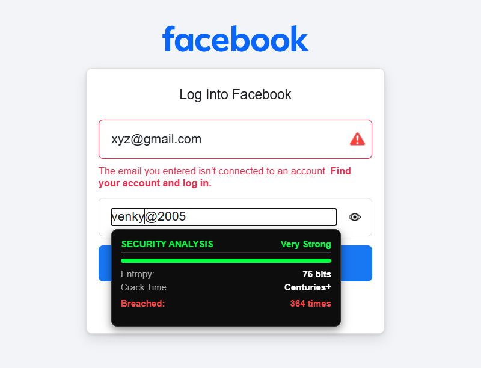
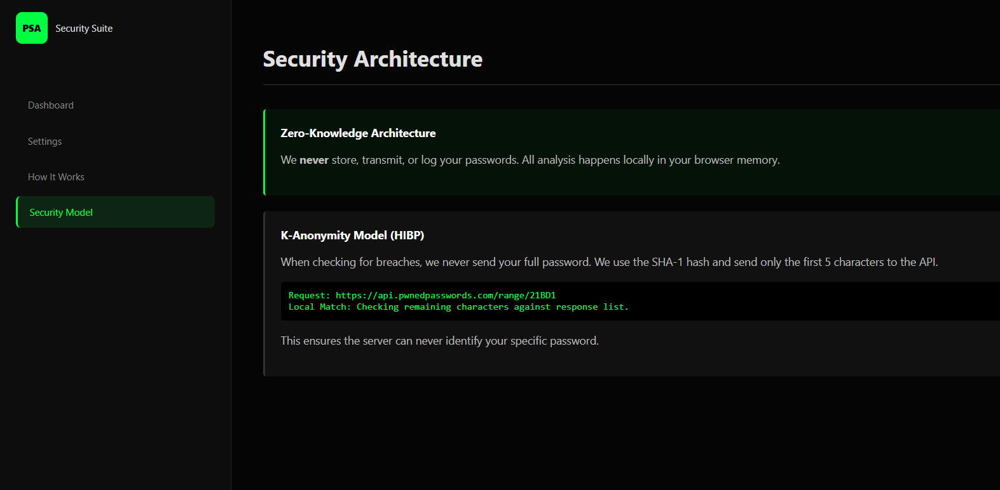

# 🔐 Password Strength Analyzer (PSA)

<p align="center">
  
  <h3 align="center">Password Strength Analyzer</h3>
  <p align="center">
    A professional, open-source Chrome Extension for real-time password security analysis and breach detection.
    <br />
    <a href="https://github.com/venkatesh-99-cbs/password-strength-analyzer/issues">Report Bug</a>
    ·
    <a href="https://github.com/venkatesh-99-cbs/password-strength-analyzer/issues">Request Feature</a>
  </p>
</p>

<p align="center">
  
  
  
</p>

---

## 📸 Screenshots

See the extension in action:

| Floating Security UI | Dashboard & Settings |
| :---: | :---: |
|  |  |

---

## 🚀 Features

*   **Real-Time Analysis:** Calculates **Shannon Entropy**, character pool size, and estimated crack time as you type.
*   **Breach Detection (HIBP):** Securely checks your password against the **Have I Been Pwned** database using **K-Anonymity**. Your password never leaves your browser.
*   **Advanced Pattern Detection:** Detects sequential (`123`), repeated (`aaa`), keyboard (`qwerty`), and date patterns.
*   **Security Dashboard:** A full-featured settings page with detailed explanations of "How it Works" and "Security Architecture".
*   **Modern UI:** Sleek dark theme with monospace fonts, inspired by cybersecurity tools.
*   **Privacy Focused:** 
    *   No tracking.
    *   No analytics.
    *   Runs 100% locally.

---

## ⚙️ Installation (Developer Mode)

Since this extension is not yet on the Chrome Web Store, follow these steps to install it manually.

### Prerequisites
*   Google Chrome (or Chromium-based browser: Edge, Brave, etc.)

### Steps

1.  **Clone the Repository**
    ```bash
    git clone https://github.com/venkatesh-99-cbs/password-strength-analyzer.git
    ```
    *(Or download the ZIP file and extract it)*

2.  **Open Chrome Extensions**
    *   Navigate to `chrome://extensions/` in your address bar.
    *   Toggle **Developer mode** in the top right corner.

3.  **Load the Extension**
    *   Click the **Load unpacked** button (top left).
    *   Select the project folder (the one containing `manifest.json`).

4.  **Start Using**
    *   Navigate to any login page (e.g., GitHub, Gmail).
    *   Click on the password field to see the security analysis panel.

---

## 🛡️ How It Works

### 1. Entropy Calculation
We calculate entropy based on the character pool size (Lowercase, Uppercase, Numbers, Symbols). Higher entropy = Harder to crack.

### 2. K-Anonymity Breach Check
When checking for breaches, we **never** send your full password to any server.
1.  We hash your password (SHA-1) locally.
2.  We send only the **first 5 characters** of the hash to the HIBP API.
3.  The API returns a list of possible breaches.
4.  We match the rest of your hash locally.

This ensures the API server cannot know your actual password.

---

## 🛠️ Tech Stack

*   **Manifest V3:** Latest standard for Chrome Extensions.
*   **Vanilla JS:** Zero dependencies for maximum performance.
*   **Shadow DOM:** Isolated styles to prevent conflicts with host websites.
*   **SubtleCrypto API:** Secure hashing implementation.

---

## 📁 Project Structure

```text
/
├── manifest.json        # Extension config
├── background.js       # Service worker
├── content.js           # Main content script
├── popup.html           # Popup UI
├── options.html         # Dashboard UI
└── utils/
    ├── analyzer.js      # Logic: Entropy & Patterns
    ├── hibp.js          # Logic: API Calls
    └── dom.js           # Logic: UI Injection
